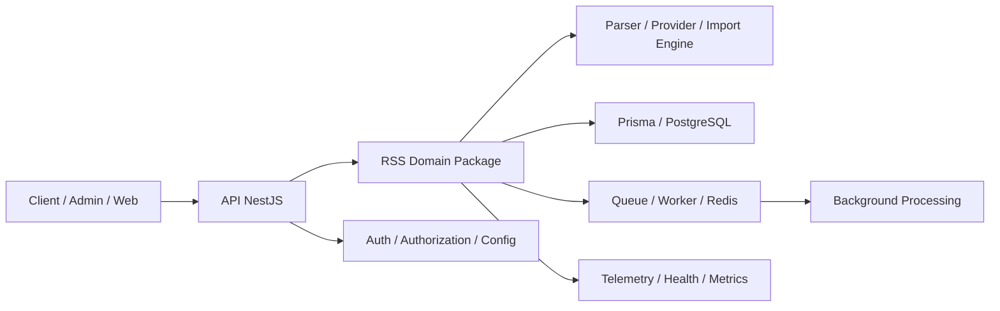

# بررسی حاکمیت معماری سازمانی پلتفرم RSS

## خلاصه اجرایی

پلتفرم RSS در این مخزن، از منظر معماری پایه، ساختار مناسبی دارد: یک آرکیتکچر چندپکیج با جداسازی نسبی میان لایه‌های API، دامنه، پایگاه داده، کارگر، صف و ابزارهای مشاهده‌پذیری، همراه با استفاده از TypeScript، Prisma، NestJS، BullMQ و یک فضای کاری Monorepo منظم. این ساختار برای شروع توسعه و ایجاد یک هسته‌ی قابل استفاده در سطح سازمانی، قابل قبول است.

با این حال، برای انتشار نهایی در محیط تولید، این سیستم هنوز در وضعیت «آماده با ریسک متوسط» قرار دارد. دلایل اصلی عبارت‌اند از:

- لایه‌ی RSS بیشتر یک فریم‌ورک یا اسکلت معماری است تا یک زیرسیستم تولیدی کاملاً تثبیت‌شده.
- برخی مسیرهای مهم در زمان اجرا، هنوز در سطح عملیاتی به‌صورت placeholder یا no-op پیاده‌سازی شده‌اند.
- ادغام واقعی با پایگاه داده، Redis/BullMQ، لاگینگ و اتوماسیون عملیاتی در سطح production هنوز به‌طور کامل اثبات نشده است.
- کنترل‌های امنیتی شبکه و XML در سطح تولید، اگرچه پایه‌ای هستند، هنوز نیاز به سخت‌سازی و enforce روشن‌تر دارند.

نتیجه‌ی نهایی این بازبینی: پلتفرم برای ورود به محیط تولید با محدودیت‌های روشن و برنامه‌ی کاهش ریسک قابل قبول است، اما برای استقرار گسترده و مقیاس‌پذیری جدی، نیاز به تثبیت‌های معماری و عملیاتی دارد.

---

## 1) بررسی حاکمیت معماری

### نقاط قوت معماری

- ساختار Monorepo با پکیج‌های جداگانه برای auth، config، database، logger، rss و سایر لایه‌ها وجود دارد.
- لایه‌ی RSS از طریق پکیج مجزا و barrel exports در [packages/rss/src/index.ts](packages/rss/src/index.ts) ارائه شده و امکان استفاده‌ی مجدد در اپلیکیشن‌ها را فراهم می‌کند.
- در سطح API، ماژول feedها به‌صورت جداگانه و با وابستگی به سرویس‌های مربوطه سازمان‌دهی شده‌اند.
- مدل داده‌ی اصلی در Prisma با جداول podcast، episode، channel و related entities پوشش داده شده است.
- وجود ابزارهای نظارتی و telemetry در بسته RSS، نشان‌دهنده‌ی آمادگی برای مشاهده‌پذیری اولیه است.

### نقاط ضعف معماری

- بسته RSS هنوز بیشتر یک هسته‌ی معماری و abstraction layer است تا یک زیرسیستم کامل و production-hardened.
- در مسیر اجرای sync، سرویس API از یک importService stubbed استفاده می‌کند و در عمل، هیچ اتصال واقعی به import pipeline و persistence انجام نمی‌دهد.
- Worker runtime برای job نوع rss-import نیز در حال حاضر یک مسیر no-op است و از نظر عملیاتی، هنوز به‌صورت واقعی به RSS pipeline متصل نشده است.
- مرزهای لایه‌ای در چند بخش به‌خاطر قرار گرفتن منطق domain و infrastructure در یک فضای فنی واحد، هنوز به‌طور کامل محافظت نشده‌اند.
- الگوی build و module resolution در سطح کل مخزن، اگرچه در بخش‌های فعلی از پکیج‌های workspace استفاده می‌کند، اما در گزارش‌های معماری قبلی نیز نشانه‌هایی از عدم یک‌دست بودن است.

### نتیجه‌ی ارزیابی معماری

معماری فعلی از نظر بنیادی سالم است، اما برای ملاحظات enterprise governance، هنوز نیاز به تثبیت بیشتر در حوزه‌ی runtime integration، operational boundary و production readiness دارد.

---

## 2) تحلیل دیاگرام معماری

### خلاصه‌ی ساختار فعلی

### تحلیل روی دیاگرام

- لایه‌ی API به‌عنوان نقطه‌ی ورود و کنترل، نقش عمده‌ای دارد.
- بسته RSS نقش هسته‌ی domain و orchestration را ایفا می‌کند.
- پایگاه داده و Redis به‌عنوان زیرساخت‌های اصلی برای state، persistence و اجرای کارهای پس‌زمینه‌ای عمل می‌کنند.
- با این حال، در نسخه‌ی فعلی، مسیرهای عملیاتی از جمله تعامل واقعی با Redis/BullMQ و persistence، هنوز تا سطح آستانه‌ی تولید کامل نشده‌اند.

---

## 3) بررسی دامنه

### مرزهای دامنه

دامنه‌ی RSS در این مخزن به‌صورت روشن در بسته‌ی مجزا تعریف شده است و شامل مفاهیمی مانند feed، episode، provider، parser، synchronization، health و telemetry می‌شود. این ساختار برای DDD و Clean Architecture مناسب است.

### نقاط قوت دامنه

- وجود abstractionهای مستقل برای parser، provider و synchronization.
- جداسازی بین import، deduplication، persistence و monitoring.
- وجود انواع و DTOهای ساختاریافته در بسته RSS.

### نقاط ضعف دامنه

- لایه‌ی application و infrastructure در چند مسیر، هنوز به‌صورت کامل از هم جدا نشده‌اند.
- بسیاری از سطوح domain-oriented serviceها، در عمل، به جای استفاده از یک implementation واقعی، بر پایه‌ی placeholders یا ساختارهای عمومی قرار گرفته‌اند.
- سرویس‌های health و telemetry، اگرچه معماری‌شان خوب است، اما برای رتبه‌بندی واقعی سلامت feedها هنوز به یک موتور scoring و classification واقعی متکی نیستند.

### نتیجه

دامنه‌ی RSS از نظر مفهومی خوب است، اما در سطح اجرا هنوز به‌عنوان یک domain model production-grade تثبیت نشده است.

---

## 4) بررسی وابستگی‌ها

### نقاط قوت

- بسته RSS وابستگی‌های خود را به‌صورت محدود نگه داشته و از انواع مشترک و توابع پایه استفاده می‌کند.
- API، worker و shared packages با استفاده از workspace و بسته‌های مجزا در کنار هم قرار گرفته‌اند.
- Prisma و shared packages، بنیاد مناسبی برای یک معماری قابل رشد می‌دهند.

### نقاط ضعف

- در سطح کل مخزن، ثبات در module resolution و build graph هنوز یک چالش معماری است.
- برخی ماژول‌های RSS از import‌های مستقیم از پنل‌های source یا path-based patterns استفاده می‌کنند، که در بلندمدت باعث کاهش predictability و افزایش ریسک build و publish می‌شود.
- وابستگی به ابزارهای خارجی مانند Redis، BullMQ و Prisma در زمان تولید، اگرچه منطقی است، اما نیاز به contractهای روشن‌تر برای failure isolation و replacement readiness دارد.

### نتیجه

وابستگی‌ها در سطح پایه قابل مدیریت‌اند، اما برای enterprise readiness نیازمند استانداردسازی بیشتر در مسیر build و integration هستند.

---

## 5) تحلیل کاندیدهای بازآرایی

### 1) ادغام واقعی موتور sync با persistence

- عنوان: تبدیل sync از مسیر scaffold به یک flow واقعی با persistence و state persistence
- دسته: معماری / قابلیت اجرایی
- شدت: بالا
- توضیح: در حال حاضر مسیر sync در API با یک importService stubbed اجرا می‌شود و ریسک این را دارد که رفتار واقعی در محیط تولید با داده‌های واقعی به‌طور کامل پوشش داده نشود.
- شواهد: [apps/api/src/modules/feeds/feeds-synchronization.service.ts](apps/api/src/modules/feeds/feeds-synchronization.service.ts)
- تاثیر کسب‌وکار: افزایش ریسک عدم اجرای درست feed sync در production
- تاثیر فنی: کاهش قابلیت اعتماد و تست‌پذیری end-to-end
- توصیه: جایگزینی stub با یک adapter واقعی به import/persistence layer
- تلاش تقریبی: متوسط
- اولویت: بسیار بالا

### 2) اتصال واقعی worker RSS به موتور import

- عنوان: تبدیل job rss-import از no-op به مسیر اجرایی واقعی
- دسته: عملیاتی / قابلیت اجرا
- شدت: بالا
- توضیح: Worker فعلی برای نوع rss-import فقط یک log و Promise.resolve دارد.
- شواهد: [apps/worker/src/worker-service.ts](apps/worker/src/worker-service.ts)
- تاثیر کسب‌وکار: امکان پردازش پس‌زمینه‌ای واقعی RSS وجود ندارد
- تاثیر فنی: ریسک بالای عدم انجام کارهای پس‌زمینه‌ای و کاهش قابلیت اتوماسیون
- توصیه: اتصال به یک orchestrator RSS واقعی و one-way job contract
- تلاش تقریبی: متوسط
- اولویت: بسیار بالا

### 3) استانداردسازی module resolution و build graph

- عنوان: یک‌دست‌سازی الگوی build و resolution در کل monorepo
- دسته: معماری / build
- شدت: بالا
- توضیح: ساختار mixed build strategy در گزارش‌های قبلی نشان داده شده است و برای production، ریسک افزونگی و خطای build را افزایش می‌دهد.
- شواهد: [ARCHITECTURE_REPORT_PHASE_1.md](ARCHITECTURE_REPORT_PHASE_1.md)
- تاثیر کسب‌وکار: زمان راه‌اندازی و پشتیبانی توسعه‌دهنده افزایش می‌یابد
- تاثیر فنی: build، cache، incremental compile و dependency validation دچار ناهماهنگی می‌شود
- توصیه: استقرار یک الگوی واحد برای workspace و project references
- تلاش تقریبی: زیاد
- اولویت: بالا

### 4) تسهیل real observability و alerting

- عنوان: اتصال telemetry به exporterهای واقعی و alert rules
- دسته: عملیاتی / مشاهده‌پذیری
- شدت: متوسط
- توضیح: telemetry و health evaluator در دسترس‌اند اما در حال حاضر به‌صورت in-memory و بدون exporterهای real-world عمل می‌کنند.
- شواهد: [packages/rss/src/telemetry/index.ts](packages/rss/src/telemetry/index.ts)
- تاثیر کسب‌وکار: کاهش توان نظارت و زمان واکنش به خرابی
- تاثیر فنی: ریسک تشخیص دیرهنگام anomalous behavior
- توصیه: اتصال به OpenTelemetry، exporterهای خارجی یا event bus
- تلاش تقریبی: متوسط
- اولویت: بالا

### 5) تقویت کنترل‌های امنیتی در لایه‌ی شبکه و XML

- عنوان: سخت‌سازی SSRF/XXE protection در مسیر RSS ingestion
- دسته: امنیت
- شدت: بالا
- توضیح: URL validation در لایه‌ی network وجود دارد، اما سیاست‌های allowlist، redirect validation و XML entity protection هنوز به‌طور کامل enforce نشده‌اند.
- شواهد: [packages/rss/src/network/request-builder.ts](packages/rss/src/network/request-builder.ts)
- تاثیر کسب‌وکار: افزایش ریسک exposure و آسیب‌پذیری در برابر حملات شبکه‌ای
- تاثیر فنی: نیاز به hardening بیشتر در parser و network boundary
- توصیه: تعریف whitelist/denylist policy و غیرفعال‌سازی entity expansion
- تلاش تقریبی: متوسط
- اولویت: بسیار بالا

---

## 6) ممیزی بدهی فنی

| موضوع                                                          | دسته                |   شدت |     اولویت | تلاش تقریبی | توضیح                                               |
| -------------------------------------------------------------- | ------------------- | ----: | ---------: | ----------: | --------------------------------------------------- |
| مسیر sync API هنوز stubbed است                                 | معماری / عملیاتی    |  بالا | بسیار بالا |       متوسط | اجرای real import و persistence هنوز انجام نشده است |
| worker rss-import no-op است                                    | عملیاتی             |  بالا | بسیار بالا |       متوسط | کار پس‌زمینه‌ای RSS واقعی در حال اجرا نیست          |
| telemetry و health evaluation هنوز در-memory است               | عملیاتی             | متوسط |       بالا |       متوسط | مانع از observability production-grade می‌شود       |
| کنترل‌های امنیتی در network/XML هنوز کامل نیست                 | امنیت               |  بالا | بسیار بالا |       متوسط | ریسک SSRF/XXE و حملات مرتبط                         |
| inconsistency در build/module resolution                       | معماری              |  بالا |       بالا |        زیاد | ریسک build و maintainability را افزایش می‌دهد       |
| placeholder و non-final implementation در چند module           | کیفیت کد            | متوسط |       بالا |       متوسط | مانع از اعتمادپذیری و طول عمر معماری می‌شود         |
| آزمون‌های end-to-end با Redis/Prisma/Auth واقعی کم است         | کیفیت / آزمون       | متوسط |       بالا |       متوسط | ریسک regressions hidden را افزایش می‌دهد            |
| مستندسازی operational runbook در سطح production هنوز کامل نیست | مستندسازی / عملیاتی | متوسط |      متوسط |          کم | افزایش ریسک در زمان incident و handoff              |

---

## 7) بررسی عملکرد

### نقاط قوت

- معماری parser و provider به‌صورت ماژولار و جدا از persistence طراحی شده‌اند.
- استفاده از request builder و validation اولیه برای کاهش هزینه‌ی پردازش بدافزارها و URLهای غیرمجاز، مزیت دارد.

### ریسک‌های عملکردی

- در مسیر import و synchronization، بدون کنترل دقیق بر حجم feed و اندازه‌ی XML، مصرف حافظه و زمان پردازش می‌تواند در feedهای بزرگ افزایش یابد.
- telemetry در-memory و متکی به bufferهای داخلی، در load بالا و با تعداد بالای رویداد، ممکن است به هزینه‌ی حافظه و نرخ drop منجر شود.
- worker و queue در حالت real production، به‌خاطر شبکه، serialization و contention، می‌توانند باعث latency در پردازش شوند.

### توصیه‌های معماری

- محدودسازی اندازه‌ی feed قبل از parse
- اعمال rate limiting و backpressure در import worker
- اندازه‌گیری مداوم queue depth، duration و memory usage

---

## 8) بررسی مقیاس‌پذیری

### ارزیابی برای سطوح مختلف

- 10K feed: پلتفرم با ساختار فعلی قابل مدیریت است.
- 100K feed: نیازمند بهینه‌سازی بیشتر در queue، persistence و sync scheduling است.
- 1M feed: بدون redesign در بخش scheduling، persistence، cache و worker isolation، ریسک بالاست.
- 10M episode: نیازمند strategy‌های partitioning، batch processing و indexing/archival جدی است.

### ارزیابی معماری

- ساختار فعلی برای تعداد moderate قابل قبول است.
- برای scale horizontal، نیاز به تثبیت چند worker، multi-node scheduler، cache layer و database partitioning وجود دارد.
- در سطح current implementation، هنوز یک مسیر production-scale و multi-node با failover روشن وجود ندارد.

---

## 9) بررسی قابلیت اطمینان

### نقاط قوت

- وجود state-machine، lock manager، lease manager و telemetry برای sync، نشانه‌ی طراحی قابل قبول برای جلوگیری از race condition است.
- وجود error handling ساختارمند و ساختار warning/error در RSS package، مزیت مهمی است.

### نقاط ضعف

- در عمل، مسیر real recovery و crash consistency هنوز تنها در سطح طراحی دیده می‌شود و به‌طور کامل با runtime واقعی آزمایش نشده است.
- worker و queue برای retries و dead-letter handling در حال حاضر به‌صورت ساده و abstract باقی مانده‌اند.
- graceful shutdown و cancel propagation در runtime واقعی هنوز به‌صورت کامل اثبات نشده‌اند.

### نتیجه

قابلیت اطمینان پایه‌ای وجود دارد، اما برای production-grade باید روی retry storm، shutdown، checkpoint consistency و failure isolation تست‌های real-world انجام شود.

---

## 10) بررسی امنیت

### نقاط قوت

- URL validation برای جلوگیری از دسترسی به localhost و private hosts در [packages/rss/src/network/request-builder.ts](packages/rss/src/network/request-builder.ts) وجود دارد.
- ساختار parser و provider از داده‌های malformed محافظت می‌شود.
- لایه‌ی API از auth و throttler استفاده می‌کند.

### نقاط ضعف

- SSRF protection هنوز به‌صورت fully policy-driven نیست و allowlist/redirect enforcement در سطح production روشن نیست.
- XML security و XXE hardening در parserها، به‌صورت صریح و قابل‌اعتماد enforce نشده است.
- کنترل‌های authorization و permission boundary برای RSS-specific operations هنوز در سطح end-to-end به‌صورت کامل مستند و validated نیست.
- استفاده از secrets و configuration در سطح environment هنوز نیاز به policy و masking قوی‌تر دارد.

### نتیجه

امنیت پایه‌ای وجود دارد، اما برای استقرار سازمانی، hardening بیشتر در network boundary و XML parsing الزامی است.

---

## 11) بررسی Maintainability

### نقاط قوت

- نام‌گذاری و ساختار ماژولار نسبتاً شفاف است.
- بسته RSS از لایه‌های مشخص و barrel exports استفاده می‌کند.
- مستندات چندلایه‌ای در docs/rss و READMEهای مربوطه وجود دارد.

### نقاط ضعف

- وجود abstractionهای متعدد در کنار implementation‌های placeholder، باعث افزایش یادگیری و پیچیدگی برای توسعه‌دهنده‌ی جدید می‌شود.
- برخی بخش‌ها بیش از حد “framework-like” هستند و باعث می‌شوند درک runtime flow برای contributor جدید دشوار شود.
- توزیع مسئولیت‌ها در لایه‌های application و infrastructure هنوز کاملاً باثبات و قابل‌پیش‌بینی نیست.

### نتیجه

Maintainability برای یک نسخه‌ی اولیه خوب است، اما برای تیم‌های بزرگ و چندساله باید با استانداردسازی بیشتر تقویت شود.

---

## 12) بررسی آینده‌پذیری

### آمادگی برای توسعه‌های آینده

- پشتیبانی از ویدیو: نیازمند extension در provider و media pipeline دارد.
- معماری چندprovider: ساختار فعلی برای این هدف مناسب است، اما نیازمند قراردادهای روشن‌تر و adapter registry کامل‌تر است.
- CQRS / Event Sourcing: هسته‌ی فعلی در این حوزه هنوز به‌صورت کامل آماده نیست.
- Microservices: پلتفرم فعلی برای decomposition در آینده مناسب است، اما باید با contract و API boundary روشن‌تر همراه شود.
- Marketplace / AI processing / recommendation engine: نیازمند modularity بیشتر و service boundaries دقیق‌تر است.

### نتیجه

پلتفرم برای رشد تدریجی مناسب است، اما برای معماری‌های مبتنی بر event-driven و multi-tenant enterprise، باید مرزها و contracts روشن‌تر شوند.

---

## 13) امتیازدهی معماری

| شاخص                        | امتیاز (۰ تا ۱۰۰) | توجیه کوتاه                                                                                                     |
| --------------------------- | ----------------: | --------------------------------------------------------------------------------------------------------------- |
| Architecture                |                74 | معماری پایه‌ای قوی و قابل فهم است، اما هنوز در سطح production-hardened کامل نیست                                |
| Code Quality                |                76 | TypeScript strict و ساختار ماژولار خوب است، اما placeholderها و inconsistencyها روی کیفیت اثر می‌گذارند         |
| DDD                         |                68 | دامنه‌ی RSS به‌خوبی شناسایی شده، اما مرزهای application/infrastructure هنوز در برخی مسیرها مبهم است             |
| Clean Architecture          |                73 | جداسازی لایه‌ای در بیشتر موارد دیده می‌شود، اما implementationهای واقعی هنوز کامل نشده‌اند                      |
| SOLID                       |                71 | اصول سادگی و مسئولیت‌پذیری در چند بخش رعایت شده، اما در لایه‌های orchestration و runtime هنوز نیاز به بهبود است |
| Maintainability             |                74 | ساختار قابل فهم و مستند است، اما abstraction overload و placeholders مانع از سهولت نگهداری می‌شود               |
| Reliability                 |                69 | پایه‌های طراحی خوب است، اما end-to-end recovery و real runtime validation هنوز ناقص است                         |
| Scalability                 |                67 | برای حجم متوسط مناسب است، اما برای load بالا و چند-node هنوز نیاز به hardening دارد                             |
| Performance                 |                72 | طراحی اولیه مناسب است، اما کنترل حجم feed، memory، queue latency و batch processing هنوز نیازمند بهبود است      |
| Security                    |                70 | کنترل‌های پایه موجودند، اما SSRF/XML hardening و authorization enforcement هنوز کامل نیست                       |
| Testing                     |                73 | تست‌ها در سطح بسته RSS خوب‌اند، اما end-to-end با real infra هنوز محدود است                                     |
| Documentation               |                78 | مستندات متنوعی وجود دارد و برای یک پروژه اولیه خوب است                                                          |
| Developer Experience        |                72 | ساختار monorepo و ابزارهای توسعه مناسب‌اند، اما build consistency و onboarding نیازمند بهبود است                |
| Production Readiness        |                71 | برای راه‌اندازی اولیه قابل قبول است، اما برای production enterprise نیاز به تثبیت بیشتری دارد                   |
| Overall Engineering Quality |                72 | در مجموع، یک پایه‌ی قوی با ریسک‌های عملیاتی و امنیتی قابل مدیریت وجود دارد                                      |

---

## 14) ۲۰ توصیه‌ی برتر

1. تبدیل مسیر sync API از stub به implementation واقعی با persistence و state persistence
2. اتصال worker RSS به یک orchestrator واقعی و حذف مسیر no-op
3. یک‌دست‌سازی module resolution و project references در کل monorepo
4. اعمال allowlist و redirect policy در لایه‌ی شبکه برای SSRF hardening
5. غیرفعال‌سازی entity expansion و اعمال تنظیمات XML security در parser
6. اتصال telemetry به exporterهای واقعی و تعریف alert rules
7. ایجاد runbookهای عملیاتی برای deployment، rollback و incident handling
8. اضافه کردن آزمون‌های end-to-end با Redis، Prisma و auth واقعی
9. تعریف contractهای روشن برای queue و worker با retry/dead-letter semantics
10. تقویت health scoring engine با معیارهای واقعی و not-placeholder
11. ایجاد policy برای size limit و backpressure در RSS import pipeline
12. ایجاد boundary روشن‌تر میان application service و infrastructure adapter
13. کاهش abstraction overload در بسته RSS با تمرکز بر use cases اصلی production
14. تعریف ownership و package governance برای shared packages و internal APIs
15. اضافه کردن monitoring برای queue depth، drop rate، import latency و sync failures
16. تقویت configuration management و masking secrets در محیط‌های مختلف
17. ارائه‌ی first-class integration test برای feed registration و sync lifecycle
18. بهبود contractهای public API برای feed operations و خروجی‌های آن
19. ایجاد سیاست‌های versioning و backward compatibility برای RSS-related APIs
20. طراحی roadmap برای multi-provider و event-driven evolution با حفظ compatibility

---

## 15) ریسک‌های باقیمانده

- ریسک عدم اجرای واقعی sync و import در production
- ریسک عدم درک درست status و health feed در حجم بالا
- ریسک ضعف observability در زمان incident
- ریسک حملات شبکه‌ای و XML-related attacks در ingress RSS
- ریسک کاهش maintainability به‌دلیل تکامل تدریجی abstractionها

---

## 16) نقشه‌ی راه بدهی فنی

### کوتاه‌مدت (۱–۲ ماه)

- تکمیل مسیر sync API و worker RSS
- اضافه کردن hardening امنیتی در network/XML
- اتصال telemetry و alerting
- تکمیل test end-to-end با infra واقعی

### میان‌مدت (۳–۶ ماه)

- یک‌دست‌سازی build graph و module resolution
- استانداردسازی contracts و package ownership
- بهینه‌سازی queue، worker و persistence برای scale
- ایجاد runbook و operational dashboards

### بلندمدت (۶+ ماه)

- طراحی event-driven و multi-provider architecture
- ایجاد قابلیت‌های plugin / marketplace / AI augmentation
- تفکیک بیشتر services و کاهش coupling

---

## 17) توصیه‌ی تولید

پلتفرم RSS در وضعیت فعلی برای استقرار کنترل‌شده و محدود قابل قبول است، اما برای انتشار سازمانی و مقیاس‌پذیر، نیازمند اقدامات زیر است:

1. تکمیل مسیرهای اجرایی واقعی قبل از deployment گسترده
2. اعمال hardening امنیتی و operational monitoring
3. انجام تست‌های end-to-end بر روی زیرساخت واقعی قبل از rollout
4. حفظ الگوی معماری فعلی اما با کاهش placeholder و افزایش contract clarity

---

## 18) رأی نهایی

### نتیجه‌ی نهایی: آماده با ریسک متوسط

این پلتفرم از نظر معماری پایه، ساختار کد و قابلیت توسعه‌ی تدریجی، یک پایه‌ی خوب دارد. با این حال، برای انتشار در سطح enterprise production، هنوز چند گپ مهم وجود دارد: اتصال واقعی به sync/import/runtime، hardening امنیتی، observability production-grade و تثبیت build graph. این موارد به‌قدری مهم‌اند که پیشنهاد می‌شود انتشار در محیط تولید با ریسک متوسط انجام شود و فقط با برنامه‌ی کاهش ریسک و کنترل‌های عملیاتی روشن انجام گیرد.

اگرچه این سیستم برای عرضه‌ی اولیه یا محیط آزمایشی مناسب است، اما برای production گسترده و مقیاس بالا، نیازمند تثبیت قبل از استقرار نهایی است.
